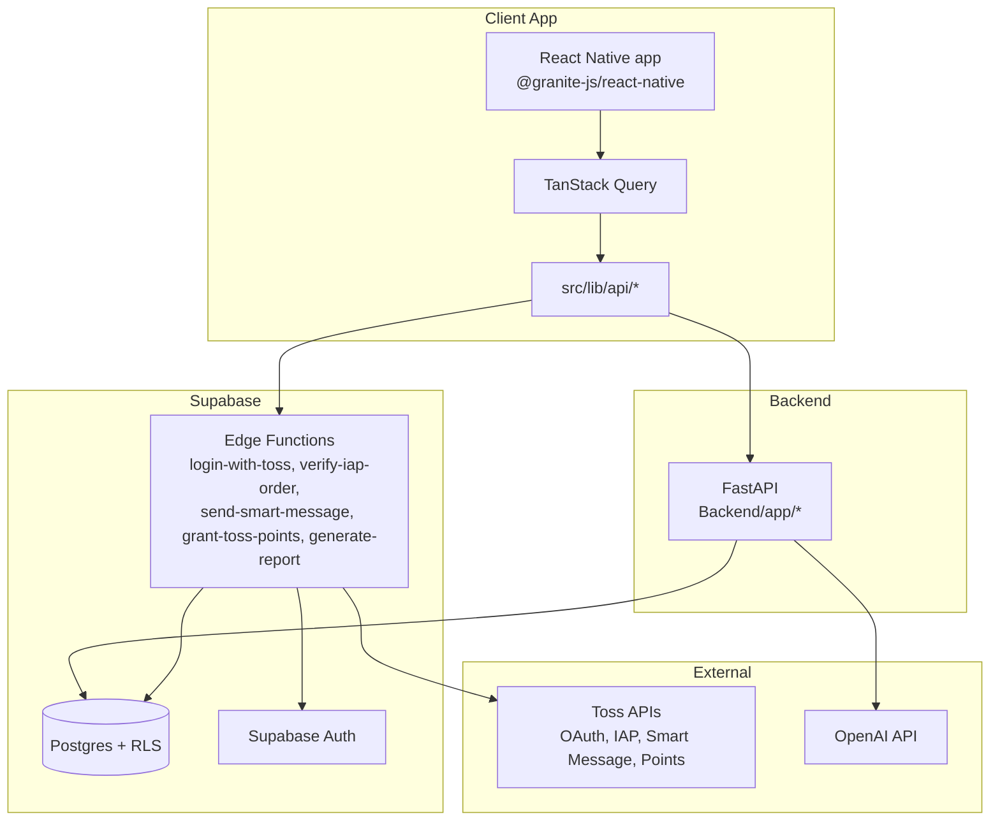

Diagram-ID: arch-01
Owner: platform
Last-Verified: 2026-03-01
Parity-IDs: APP-001, AUTH-001, IAP-001, B2B-001
Source-of-Truth:
- CLAUDE.md
- src/lib/api/backend.ts
- supabase/functions/CLAUDE.md
Update-Trigger:
- Backend/Edge boundary changes
- New external dependency introduced

# 01. System Topology

## Notes
- S2S and mTLS-bound logic stays in Edge Functions.
- FastAPI handles app business APIs and AI composition.
- Data access boundary is enforced by RLS in Supabase DB.
