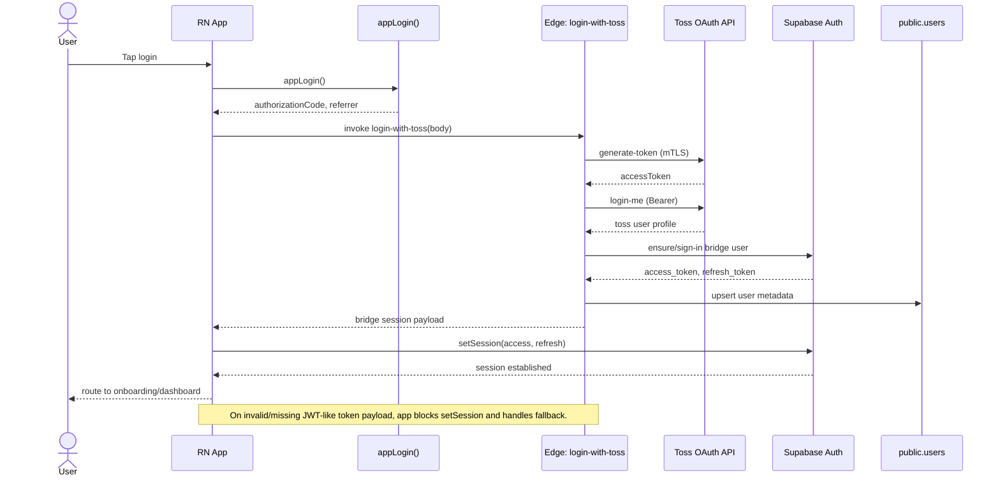

Diagram-ID: arch-02
Owner: auth
Last-Verified: 2026-03-01
Parity-IDs: AUTH-001, REG-001
Source-of-Truth:
- src/pages/login.tsx
- src/lib/api/auth.ts
- supabase/functions/login-with-toss/index.ts
Update-Trigger:
- login payload/response schema changes
- bridge session set policy changes

# 02. Auth Sequence (Toss Login Bridge)

