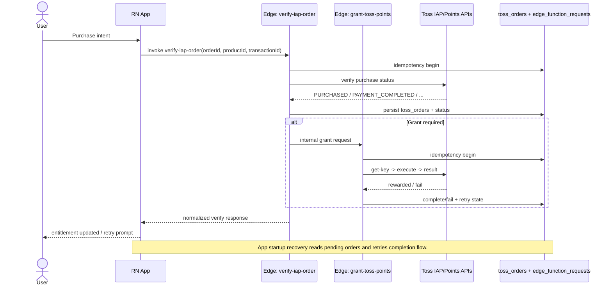

Diagram-ID: arch-03
Owner: monetization
Last-Verified: 2026-03-01
Parity-IDs: IAP-001
Source-of-Truth:
- src/lib/api/iap.ts
- src/lib/api/subscription.ts
- supabase/functions/verify-iap-order/index.ts
- supabase/functions/grant-toss-points/index.ts
Update-Trigger:
- toss status mapping changes
- retry/idempotency policy changes

# 03. IAP + Points Sequence

