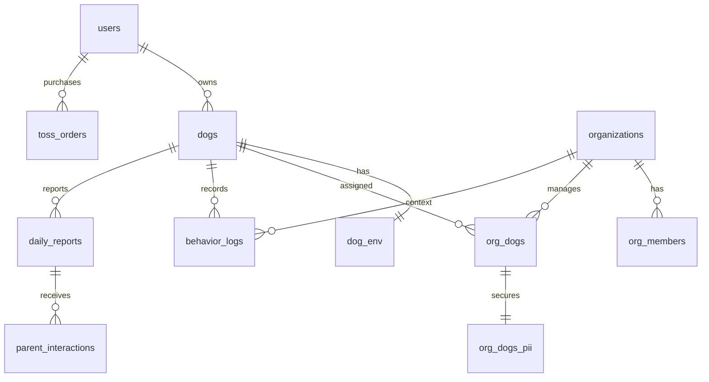

Diagram-ID: arch-05
Owner: data-platform
Last-Verified: 2026-03-01
Parity-IDs: AUTH-001, IAP-001, B2B-001
Source-of-Truth:
- docs/ref/SUPABASE-SCHEMA-INDEX.md
- supabase/migrations/*.sql
- Backend/app/shared/models.py
Update-Trigger:
- migration applied
- RLS policy/function changes

# 05. Data + RLS Boundary

## RLS Trust Zones
- User zone: own `dogs`, `dog_env`, `toss_orders`, `subscriptions`, `user_training_status`
- Org zone: `organizations`, `org_members`, `org_dogs`, `daily_reports`, `org_analytics_daily`
- Parent zone: scoped read/reaction through `is_parent_of_dog()` and report link constraints
- PII zone: `org_dogs_pii` direct access denied, only via `get_parent_contact()`

## Core RLS Helpers
- `is_org_member(uuid)`
- `is_org_member_with_role(uuid, text[])`
- `is_parent_of_dog(uuid)`
- `get_parent_contact(uuid)`
- `purge_expired_pii()`
