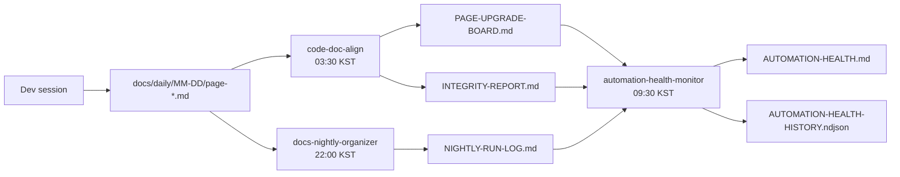

Diagram-ID: arch-06
Owner: ops
Last-Verified: 2026-03-02
Parity-IDs: APP-001, REG-001, MSG-001
Source-of-Truth:
- .claude/automations/code-doc-align.prompt.md
- .claude/automations/docs-nightly-organizer.prompt.md
- docs/status/AUTOMATION-HEALTH.md
- docs/status/NIGHTLY-RUN-LOG.md
Update-Trigger:
- automation schedule/lock/artifact changes

# 06. Runtime, Deploy, and Observability

## Operational Rule
- If automation reports stale/missing artifacts, treat documentation as stale until re-synced.
